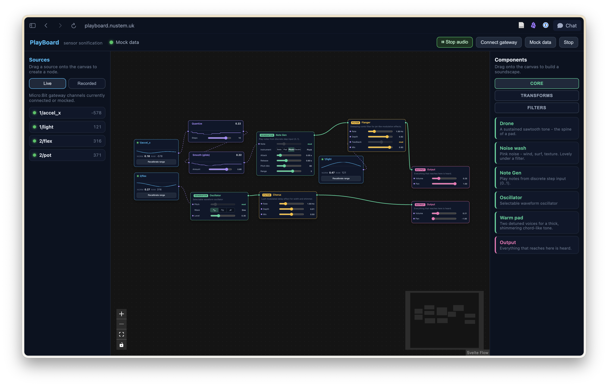

# Sonification-PlayBoard

A modular playground for **data sonification**, lashed together as a demo/proof-of-concept project for [Sonic Intangibles](https://sonicintangibles.github.io/) with the intention of exploring its use for public engagement work.

Core features, at time of writing:

- A browser-native, node-graph soundscape builder (Svelte + Tone.js)
- A micro:bit gateway that relays sensor readings from networked micro:bits to the browser, over USB serial
- Basic support for CSV saved data sources
- Basic generators (some of which sound... not entirely awful), data manipulation/transformation, and audio filter nodes
- Automatic range normalisation for input sources



Playboard is available for use at [playboard.nustem.uk](https://playboard.nustem.uk/), and the code is open source under the MIT License.

## Developer notes & suggested usage

This initial incarnation of PlayBoard was built by a novice sonifier - someone sufficiently new to the field that he doesn't yet know that isn't even a word. It likely makes some poor, rash, or even catastrophic assumptions or choices. Hopefully one or two are reasonable, or even interesting. Iterating on the current version is recommended. It may even be best to mine it for ideas and start over.

### AI usage

This is pretty much a Claude product, at this point. Almost all the code was AI-generated, though key design decisions were specified or framed by - or at least discussed with - a human. The human makes no apology for this: PlayBoard was deliberately a quick lash-up to test out an idea, in a hurry, ahead of a project meeting. It would have happened "with AI, or not at all."

That it (a) works, (b) looks pretty good, and (c) is actually usable is mostly Claude's doing. It turns out Claude is alarmingly good at building functional TypeScript applications, particularly if you give it a fairly clear specification to chew on first. The bulk of the system was functional after a single prompt, and about $10-worth of tokens. Subsequently, the human has guided some significant refactoring (to make adding and removing nodes much easier) and the AI has spent about another $10 on tokens.

## Underpinning assumptions

Playboard is intended to be discoverable and explorable. While many of the concepts will be unfamiliar for its audience, the interface should be intuitive enough to encourage experimentation and play with only a limited introduction. Opinions vary on to what extent this is currently true; careful testing and tutorials will be needed.

Sources are assumed to be minimal and uncalibrated. They're not taking precise measurements, they're streaming data that is 'good enough' to explore sonification ideas. All 'meaning' is applied in the web app, not in the sources.

### Normalisation

Normalisation is 'taken care of.' Which is a one way of saying 'will work seamlessly, until it absolutely doesn't.'

Input data is taken 'raw' and scaled to a `0 .. 1.0` range based on the minimum and maximum values seen for that channel. This is simple, but 'mostly works.' Occasional data spikes from sources can throw off the autocalibration: the 'recalibrate' button on sources will reset the min/max for that channel.

One side-effect of this decision is that PlayBoard draws a distinction between _data_ and _sounds_:

### _Data_ vs _Sounds_ : Transforms, Generators, Filters, Outputs

- Data is the raw input. **Transforms** operate on data, manipulating it within the `0 .. 1.0` range.
- **Generators** take data inputs and produce sound outputs. Transforms can't be applied to sound outputs.
- **Filters** operate on sound outputs; they can't be applied to data inputs.
- **Outputs** receive sounds and... play them.

Sequentially, then:

> **Source** → **Data** → **Transform** → **Generator** → **Filter** → **Output**

To the original author this makes sense: you acquire data, process it, sonify it, then manipulate the resulting audio. Validation (or arguments against this approach) welcome.

I have, however, been caught out by the inability to apply Transforms to audio nodes. The app tries to prompt about this by showing different kinds of affordance and connection colours/animations, but some work is likely needed here to make the distinction clearer.

## Quick start

You'll need `npm`, usually installed as part of a Node.js installation. If you don't have it, see [https://nodejs.org/en/download/](https://nodejs.org/en/download/).

```bash
cd webapp
npm install
npm run dev
```

Open the printed `localhost` URL in **Chrome** or a **Chrome-based** browser (necessary for WebUSB serial connections).

Data sources are in the left column, while the right column contains nodes. Both columns are tabbed to keep list sizes manageable. The window is dominated by the central canvas area, on which you assemble nodes and their connections.

### Data sources

Toggle between source types at the top of the left column. The different types can coexist on the canvas, and a single source can be included more than once.

#### Micro:Bits

See the [microbit](microbit/) directory for details on the (very basic) data streaming system. Flash a Micro:Bit device with the `hub_sink.ts` code and attach it via USB to the computer running PlayBoard. Click 'Connect gateway' (upper right) and choose the Micro:Bit in the resulting dialogue.

Micro:Bit devices running one of the `source*.ts` scripts will populate the source column as they become available (note that they will *not* be removed if they disconnect, but will rejoin and return to streaming data once they reconnect). Sources declare their name (typically a number) and a data source identifier (`accel_x`, for example). Source may be dragged to the canvas. A [sparkline](https://en.wikipedia.org/wiki/Sparkline)-style plot gives reassurance that data in streaming, aids in device identification, and can help identify normalisation issues. It also looks cool.

At present, Micro:Bit devices can stream multiple channels of data, which appear separately in the source list. I'll file an Issue about this, because I think it may be better to have a node represent a device _and all of its source streams_, as we have with recorded data sources (see below). But I'm not sure.

The Micro:Bit code could be cleaned up considerably, which would make it easier for users to change sensor types and perhaps perform some on-device data processing. Again: Issue incoming.

Most Micro:Bit sources will output 10-bit signed integers (`-1023 .. 1023`); PlayBoard just normalises to `-1.0 .. 1.0` floats so each source can make its own decisions. The `src,chan,val` wire protocol is frozen and documented in [docs/PROTOCOL.md](docs/PROTOCOL.md) (this sentence was inserted by Copilot, and frankly that's news to me. I should check PROTOCOL.md is even vaguely correct. It probably is, but 'protocol' is probably overstating the amount of care involved.)

#### Mock data

For testing purposes, or if you don't have a Micro:Bit to hand, PlayBoard can generate synthetic data sources. Click **Mock data** to play with synthetic sensors. They don't behave very realistically, but they do allow you to make bleepy sounds (and worse) without flashing and plugging and all that malarkey.

#### Recorded sources: CSV data

The `Recorded` source tab allows you to load CSV files containing columnar data. Each column is exported as a separate source, named for the column header. There's no handling of timestamps or time-series data: the rows are expected to be sampled at a fixed rate. This could be improved, but may be appropriate for the intended audience anyway.

Example data is provided in the `webapp/sample-data` directory. It's pretty terrible; pull requests welcome.

## What's in this repository

| Path | What it is |
| --- | --- |
| [webapp/](webapp/) | The app: Svelte + Vite SPA, Svelte Flow node canvas, Tone.js soundscape, Web Serial gateway. **Start here.** |
| [docs/PROTOCOL.md](docs/PROTOCOL.md) | The `src,chan,val` wire protocol used by streaming Micro:Bit sources |
| [microbit/](microbit/) | MakeCode firmware: the radio→serial **gateway** ([`hub_sink.ts`](microbit/hub_sink.ts)) + sensor **sources** |
| [legacy/](legacy/) | The original Python bridge + Sonic Pi sketches, kept for reference. Superseded by the web app. |
| [docs/TODO-dynamic-mapping.md](docs/TODO-dynamic-mapping.md) | Earlier roadmap notes — **superseded** by the web app (see the banner at its top) |

See also Issues for work that is - or should be - ongoing.

## Nodes, their types, proclivities, and limitations.

At time of writing none of the nodes are implemented with particular care. Some of them don't work quite as expected, while others have obvious room for improvement. I'll file Issues about several. Generators are particularly problematic, mostly because the contributors to date are fairly clueless about sonification.

Accordingly, it's expected

### Adding a new node

1. Create a new `.ts` file in `webapp/src/lib/nodes/definitions/` (e.g., `myNode.ts`)
2. Define a `NodeSpec` with metadata and parameters
3. Create and export a `NODE_MODULE` using one of:
   - `TransformNodeModule` — for data transforms (operates on `-1.0 .. 1.0` signals)
   - `AudioNodeModule` — for generators, filters, and outputs (uses Tone.js)
   - `SourceNodeModule` — for data sources

The system auto-discovers any `.ts` file exporting a `NODE_MODULE` via `import.meta.glob`, so no manual registration is needed. See existing definitions in `webapp/src/lib/nodes/definitions/` for examples (e.g., `scale.ts` for transforms, `oscillator.ts` for audio generators).

### Hiding nodes without deletion

To hide a node from the right-hand column without removing the code:

1. **Pass `enabledInWell: false`** when creating the module: `new TransformNodeModule(spec, processor, false)`
2. **Comment out the export** — the auto-discovery will skip the file
3. **Add a feature flag** in `webapp/src/lib/nodes/registry.ts` (line ~47) to disable specific nodes dynamically

## Building for deployment, and hosting

```bash
cd webapp
npm run build
```

This produces a `dist/` directory containing the built app. The contents of this directory can be served by any static web server, or deployed to GitHub Pages (or similar). At present there's no automated deployment to [playboard.nustem.uk](https://playboard.nustem.uk/), but I may well add that because I've never actually had cause to automate a deployment before, and it seems like a good idea. However, the app may well end up abandoned, superseded, or hosted elsewhere. It's all good.

## Previous versions

The `[legacy/](legacy)` directory holds a short-lived previous approach, preserved because it may be interesting. Micro:Bits were again used as sources, bridged through one acting as a network → serial adaptor. A Python script received serial data and exported it as OSC streams, for ingest into Sonic Pi as a sonification engine.

The result was functional (and fun!), but deemed more complex than necessary for the intended user groups. It also focussed on manipulating playback of an existing song: musification rather than sonification? It was a learning process.

See [legacy README](legacy/README.md) for usage details.

## Credits

Claude, obviously. Thanks, mate.

Notional guidance and occasional ideas contributed by Jonathan Sanderson, NUSTEM / [@jjsanderson](https://github.com/jjsanderson).
