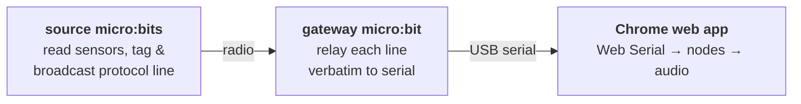

# micro:bit firmware

The hardware end of the chain: small MakeCode programs that turn micro:bits into
**sensor sources** and one **radio→serial gateway**, all speaking the project
[wire protocol](../docs/PROTOCOL.md).



Each source reads its sensors, tags every reading with its own `src` id and a
`chan` name, and broadcasts the finished protocol line (`src,chan,val`) over
radio. The gateway does no thinking at all — it just copies whatever arrives on
the radio straight out to USB serial. All *meaning* (ranging, scaling, what
controls what) lives in the [web app](../webapp/).

## The programs

| File | Role | Sensors → channels |
|---|---|---|
| [bridge.ts](bridge.ts) | Gateway (plugs into the computer) | — relays data from Micro:Bits to webapp — |
| [source_1_light_accel.ts](source_1_light_accel.ts) | Example source, built-in sensors | `light` (0–255), `accel_x` (±1024) |
| [source_2_pot_flex.ts](source_2_pot_flex.ts) | Example source, analogue pins | `pot` (P0), `flex` (P1) |

Each `src/chan` pair shows up as a draggable **Live source** in the web app
(e.g. `1/light`, `2/pot`), so there is nothing to hand-configure — connect the
gateway and the channels appear.

## Two rules that must hold

1. **Same radio group.** Every micro:bit here sets `RADIO_GROUP = 7`. They only
   hear each other if the numbers match. This allows multiple PlayBoards to coxist
   in the same room, but also for students to set different numbers then wonder why nothing works.
2. **`SRC` is the device's identity.** A source's `SRC` is the name you'll see
   in the app's source list. Give each source a distinct `SRC`; the value is
   free-form (`[A-Za-z0-9_]`).

> It's worth noting that no sanitisation is performed on `SRC` or `chan` labels; a student entering inappropriate text would prompt that to appear in the web app, presumably at the front of the class. Filtering would probably need to be done at the web app level. See Issues [#25](https://github.com/NUSTEM-UK/Sonification-PlayBoard/issues/25) and [#26](https://github.com/NUSTEM-UK/Sonification-PlayBoard/issues/26) for implications.

## Flashing

These are written in MakeCode's JavaScript so they paste cleanly:

1. Open <https://makecode.microbit.org> → **New Project**.
2. Switch the editor from **Blocks** to **JavaScript** (top toggle).
3. Replace everything with the contents of one `.ts` file here.
4. **Download** the `.hex` and drag it onto the `MICROBIT` USB drive. Alternatively: pair the Micro:Bit with MakeCode and flash directly from the browser.
5. Repeat for each micro:bit (one hub, one or more sources). Be sure to update the SRC label for each source.

Flipping back to **Blocks** works too — the JavaScript round-trips, so students
can tinker with the block view after flashing.

## Wiring source 2

Both pins are read with `analogReadPin` (0–1023), so each sensor is just a
voltage divider to the big edge pads (use crocodile clips):

- **Potentiometer** → outer legs to **3V** and **GND**, wiper (middle) to **P0**.
- **Flex sensor** → flex sensor and a ~47 kΩ fixed resistor in series between
  **3V** and **GND**; read their **junction on P1**.

Source 1 needs no wiring — it uses the on-board light sensor (the LED matrix)
and accelerometer.

## Running it

1. Power the source micro:bit(s) (battery or USB). The top-left LED flickers as
   they broadcast.
2. Plug the **gateway** into the computer. It shows ✓ briefly, then a centre LED
   blinks on each relayed message.
3. Open the [web app](../webapp/) in **Chrome**, click **Connect gateway**, and
   pick the micro:bit's serial port. Each live channel appears in the **Live
   sources** panel — drag one onto the canvas and wire it into a sound.

## Sanity-checking without the app

Any serial monitor at **115200 baud** (the Arduino IDE, `screen`, or MakeCode's
own serial console) will show the raw lines streaming from the gateway:

```
# hub alive, group 7
1,light,142
1,accel_x,-37
2,pot,880
2,flex,512
```

The `#` line is the gateway's heartbeat — the protocol treats `#` lines as
comments and ignores them, so a quiet sensor still proves the link is up.

## Notes / gotchas

- **Radio string limit.** A `radio.sendString` payload is capped at ~19
  characters. Our longest line, `1,accel_x,-1024`, is 15 — fine — but keep new
  channel names short if you add sensors. See [#27](https://github.com/NUSTEM-UK/Sonification-PlayBoard/issues/27) for a discussion of the limit and possible workarounds.
- **`accel_x` range.** The accelerometer reports milli-g and can briefly exceed
  ±1024 under a sharp knock. The app learns each channel's range and clamps the
  normalised result, so spikes just saturate; hit **Re calibrate** on the source
  node if a stray knock has stretched the range. See [#15](https://github.com/NUSTEM-UK/Sonification-PlayBoard/issues/15) for a discussion of transient handling in the webapp.
