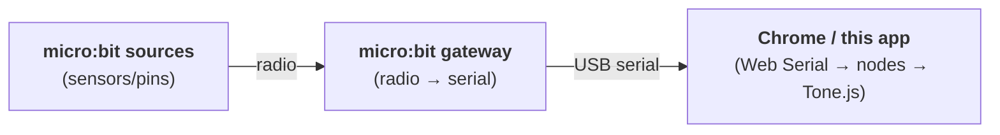

# PlayBoard web app

In-browser sensor sonification. A node-graph UI where **live sensor channels** (from a micro:bit serial gateway) are wired into an **ambient soundscape** built from generators and filters. Everything runs in one tab in your web browser.



### Browser support

Most browsers should work for recorded data sources. Live-streaming data from Micro:Bit devices relies on WebUSB, which is supported by Chrome and other Chrome-based browsers like Edge and Dia. Opera should also work, but has not been tested.

Safari and Firefox will not work for streaming live data, though mock or recorded data can be used. Mobile devices (phones, tablets) have not been tested. While the page will load, dragging nodes and connections probably doesn’t work.

## Run it

```bash
cd webapp
npm install
npm run dev        # opens on http://localhost:5173
```

Then in the app:

1. Click **🔊 Start audio** (browsers require a user gesture before sound).
2. Click **Mock data** to stream synthetic sensors with no hardware — or
   **Connect gateway** to pick the micro:bit's serial port, or 'Recorded' to load CSV data.
3. Drag a channel from **Live sources** (left) onto the canvas.
4. Add data transforms to the signal path if you wish (e.g. smoothing, quantisation, inverstion)
5. Drag a **Generator** and the **Output** from the **Components** well
   (right) onto the canvas. Connect generator → Output (the green audio ports
   are on the left/right edges: audio out on the right, audio in on the left).
6. Drag from a source's right-hand port into a generator parameter's left-hand
   port to **modulate** it with the sensor. Twist the sensor and listen.

## How it fits together

| Area             | File                       | Role                                                       |
|------------------|----------------------------|------------------------------------------------------------|
| Wire protocol    | serial/protocol.ts         | Parse `src,chan,val` input data                            |
| Gateway          | serial/gateway.svelte.ts   | Web Serial + mock; normalizes channels to 0..1             |
| Node definitions | nodes/definitions/         | Each node module with spec and behavior; auto-discovered   |
| Graph store      | graph/graph.svelte.ts      | Canvas nodes/edges; connection validation                  |
| Signal tick      | graph/tick.ts              | ~30 Hz loop: sources → transforms → modulation             |
| Runtime          | graph/runtime.ts           | Per-node values + sparkline buffer                         |
| Audio engine     | audio/engine.ts            | Converts graph into live Tone.js chain                     |
| UI               | components/                | Toolbar, panels, canvas, node components                   |

### Two kinds of wire

Connections carry one of two things, and the handle positions make it legible:

- **Signal** (control data, normalised `0..1`) — flows **left → right**. Emitted
  by sources and transforms; lands on a transform input or on a node
  **parameter** (where it becomes modulation). Thin, animated violet wires.
- **Audio** (actual sound) — flows **left → right**. Generator → filter →
  output. Thick green wires.

Connections are validated so you can't cross the two (see `isValidConnection`).

### Where ranges come from

Sources stay **dumb** — the micro:bit emits raw integers. Each channel is
normalised to `0..1` *in the app* by an auto-expanding learned range, and a
**Recalibrate** button on the source node resets that range so you can "wiggle"
the sensor through its real travel and ignore earlier spikes. A `0..1` signal is
then mapped into a parameter's real range when it modulates (log-aware, so pitch
and cutoff sweep musically).

### Node palette

- **Transforms** (signal → signal, with a sparkline): rolling average, smooth
  (glide), rate of change, scale & offset.
- **Generators** (make sound): drone, warm pad, noise wash.
- **Filters** (shape sound): low-pass, reverb, echo.
- **Output**: master out (one per board).

## Build for deployment

```bash
npm run build      # static bundle in dist/
```

The whole thing is a static single-page application: host the contents of `dist/` anywhere that serves over `https` (Web Serial requirement) and a class can open it in Chrome.

## Developer Docs

- [Node module examples](docs/NODE_MODULE_EXAMPLES.md): one example each for source, transform, generator, and output modules.
